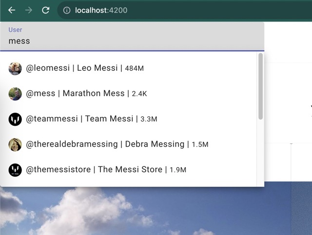
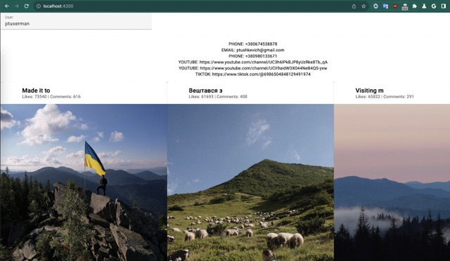

- Base requirements: node 18 LTS

Back-end:
- cd ./imai-back
- setup auth-key for https://imai.co/. check example - auth-key.example.json
- npm i
- npm run start
- can check base api on http://localhost:3000/(users/feed/contacts) with base cashing

Front-end:
- cd ./imai-front
- npm i
- npm run start
- can check base UI on http://localhost:4200/

